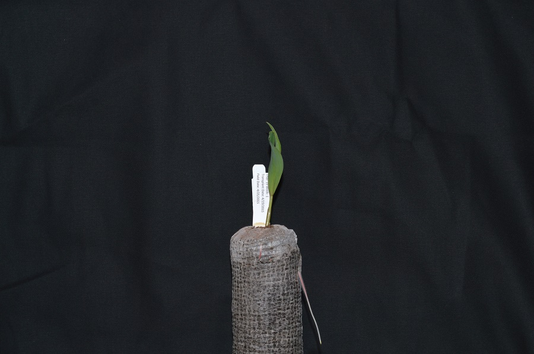
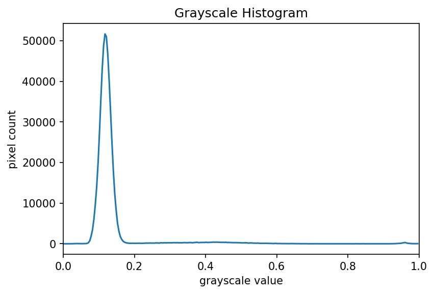
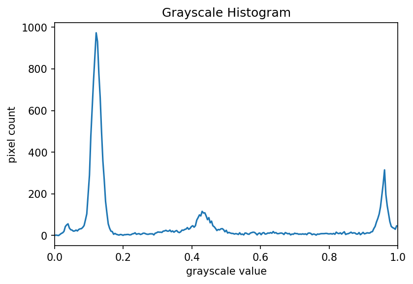
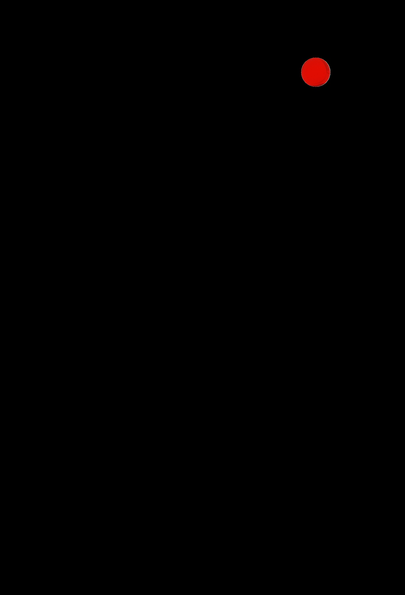

::::::::::::::::::::::::::::::::::::::: objectives

- Explain what a histogram is.
- Load an image in grayscale format.
- Create and display grayscale and colour histograms for entire images.
- Create and display grayscale and colour histograms for certain areas of images, via masks.

::::::::::::::::::::::::::::::::::::::::::::::::::

:::::::::::::::::::::::::::::::::::::::: questions

- How can we create grayscale and colour histograms to understand the distribution of colour values in an image?

::::::::::::::::::::::::::::::::::::::::::::::::::

In this episode, we will learn how to use scikit-image functions to create and
display histograms for images.

## First, import the packages needed for this episode

```python
import numpy as np
import matplotlib.pyplot as plt
import ipympl
import imageio.v3 as iio
import skimage
import skimage.draw
%matplotlib widget
```

## Introduction to Histograms

As it pertains to images, a *histogram* is a graphical representation showing
how frequently various colour values occur in the image.
We saw in
[the *Image Basics* episode](02-image-basics.md)
that we could use a histogram to visualise
the differences in uncompressed and compressed image formats.
If your project involves detecting colour changes between images,
histograms will prove to be very useful,
and histograms are also quite handy as a preparatory step before performing
[thresholding](07-thresholding.md).

## Grayscale Histograms

We will start with grayscale images,
and then move on to colour images.
We will use this image of a plant seedling as an example:
{alt='Plant seedling'}

Here we load the image in grayscale instead of full colour, and display it:

```python
# read the image of a plant seedling as grayscale from the outset
plant_seedling = iio.imread(uri="data/plant-seedling.jpg", mode="L")

# convert the image to float dtype with a value range from 0 to 1
plant_seedling = skimage.util.img_as_float(plant_seedling)

# display the image
fig, ax = plt.subplots()
plt.imshow(plant_seedling, cmap="gray")
```

{alt='Plant seedling'}

Again, we use the `iio.imread()` function to load our image.
Then, we convert the grayscale image of integer dtype, with 0-255 range, into
a floating-point one with 0-1 range, by calling the function
`skimage.util.img_as_float`.
We will keep working with images in the value range 0 to 1 in this lesson.

We now use the function `np.histogram` to compute the histogram of our image
which, after all, is a NumPy array:

```python
# create the histogram
histogram, bin_edges = np.histogram(plant_seedling, bins=256, range=(0, 1))
```

The parameter `bins` determines the number of "bins" to use for the histogram.
We pass in `256` because we want to see the pixel count for each of
the 256 possible values in the grayscale image.

The parameter `range` is the range of values each of the pixels in the image can have.
Here, we pass 0 and 1,
which is the value range of our input image after transforming it to grayscale.

The first output of the `np.histogram` function is a one-dimensional NumPy array,
with 256 rows and one column,
representing the number of pixels with the intensity value corresponding to the index.
I.e., the first number in the array is
the number of pixels found with intensity value 0,
and the final number in the array is
the number of pixels found with intensity value 255.
The second output of `np.histogram` is
an array with the bin edges and one column and 257 rows
(one more than the histogram itself).
There are no gaps between the bins, which means that the end of the first bin,
is the start of the second and so on.
For the last bin, the array also has to contain the stop,
so it has one more element, than the histogram.

Next, we turn our attention to displaying the histogram,
by taking advantage of the plotting facilities of the Matplotlib library.

```python
# configure and draw the histogram figure
plt.figure()
plt.title("Grayscale Histogram")
plt.xlabel("grayscale value")
plt.ylabel("pixel count")
plt.xlim([0.0, 1.0])  # <- named arguments do not work here

plt.plot(bin_edges[0:-1], histogram)  # <- or here
```

We create the plot with `plt.figure()`,
then label the figure and the coordinate axes with `plt.title()`,
`plt.xlabel()`, and `plt.ylabel()` functions.
The last step in the preparation of the figure is to
set the limits on the values on the x-axis with
the `plt.xlim([0.0, 1.0])` function call.

:::::::::::::::::::::::::::::::::::::::::  callout

## Variable-length argument lists

Note that we cannot used named parameters for the
`plt.xlim()` or `plt.plot()` functions.
This is because these functions are defined to take an arbitrary number of
*unnamed* arguments.
The designers wrote the functions this way because they are very versatile,
and creating named parameters for all of the possible ways to use them
would be complicated.


::::::::::::::::::::::::::::::::::::::::::::::::::

Finally, we create the histogram plot itself with
`plt.plot(bin_edges[0:-1], histogram)`.
We use the **left** bin edges as x-positions for the histogram values by
indexing the `bin_edges` array to ignore the last value
(the **right** edge of the last bin).
When we run the program on this image of a plant seedling,
it produces this histogram:

{alt='Plant seedling histogram'}

:::::::::::::::::::::::::::::::::::::::::  callout

## Histograms in Matplotlib

Matplotlib provides a dedicated function to compute and display histograms:
`plt.hist()`.
We will not use it in this lesson in order to understand how to
calculate histograms in more detail.
In practice, it is a good idea to use this function,
because it visualises histograms more appropriately than `plt.plot()`.
Here, you could use it by calling
`plt.hist(image.flatten(), bins=256, range=(0, 1))`
instead of
`np.histogram()` and `plt.plot()`
(`*.flatten()` is a NumPy function that converts our two-dimensional
image into a one-dimensional array).

::::::::::::::::::::::::::::::::::::::::::::::::::

:::::::::::::::::::::::::::::::::::::::  challenge

## Using a mask for a histogram (15 min)

Looking at the histogram above,
you will notice that there is a large number of very dark pixels,
as indicated in the chart by the spike around the grayscale value 0.12.
That is not so surprising, since the original image is mostly black background.
What if we want to focus more closely on the leaf of the seedling?
That is where a mask enters the picture!

First, hover over the plant seedling image with your mouse to determine the
*(x, y)* coordinates of a bounding box around the leaf of the seedling.
Then, using techniques from
[the *Drawing and Bitwise Operations* episode](04-drawing.md),
create a mask with a white rectangle covering that bounding box.

After you have created the mask, apply it to the input image before passing
it to the `np.histogram` function.

:::::::::::::::  solution

## Solution

```python

# read the image as grayscale from the outset
plant_seedling = iio.imread(uri="data/plant-seedling.jpg", mode="L")

# display the image
fig, ax = plt.subplots()
plt.imshow(plant_seedling, cmap="gray")

# create mask here, using np.zeros() and skimage.draw.rectangle()
mask = np.zeros(shape=plant_seedling.shape, dtype="bool")
rr, cc = skimage.draw.rectangle(start=(199, 410), end=(384, 485))
mask[rr, cc] = True

# display the mask
fig, ax = plt.subplots()
plt.imshow(mask, cmap="gray")

# mask the image and create the new histogram
histogram, bin_edges = np.histogram(plant_seedling[mask], bins=256, range=(0.0, 1.0))

# configure and draw the histogram figure
plt.figure()

plt.title("Grayscale Histogram")
plt.xlabel("grayscale value")
plt.ylabel("pixel count")
plt.xlim([0.0, 1.0])
plt.plot(bin_edges[0:-1], histogram)

```

Your histogram of the masked area should look something like this:

{alt='Grayscale histogram of masked area'}


:::::::::::::::::::::::::

::::::::::::::::::::::::::::::::::::::::::::::::::

## Colour Histograms

We can also create histograms for full colour images,
in addition to grayscale histograms.
We have seen colour histograms before,
in [the *Image Basics* episode](02-image-basics.md).
A program to create colour histograms starts in a familiar way:

```python
# read original image, in full color
plant_seedling = iio.imread(uri="data/plant-seedling.jpg")

# display the image
fig, ax = plt.subplots()
plt.imshow(plant_seedling)
```

We read the original image, now in full colour, and display it.

Next, we create the histogram, by calling the `np.histogram` function three
times, once for each of the channels.
We obtain the individual channels, by slicing the image along the last axis.
For example, we can obtain the red colour channel by calling
`r_chan = image[:, :, 0]`.

```python
# tuple to select colors of each channel line
colors = ("red", "green", "blue")

# create the histogram plot, with three lines, one for
# each color
plt.figure()
plt.xlim([0, 256])
for channel_id, color in enumerate(colors):
    histogram, bin_edges = np.histogram(
        plant_seedling[:, :, channel_id], bins=256, range=(0, 256)
    )
    plt.plot(bin_edges[0:-1], histogram, color=color)

plt.title("Color Histogram")
plt.xlabel("Color value")
plt.ylabel("Pixel count")
```

We will draw the histogram line for each channel in a different colour,
and so we create a tuple of the colours to use for the three lines with the

`colors = ("red", "green", "blue")`

line of code.
Then, we limit the range of the x-axis with the `plt.xlim()` function call.

Next, we use the `for` control structure to iterate through the three channels,
plotting an appropriately-coloured histogram line for each.
This may be new Python syntax for you,
so we will take a moment to discuss what is happening in the `for` statement.

The Python built-in `enumerate()` function takes a list and returns an
*iterator* of *tuples*, where the first element of the tuple is the index and the second element is the element of the list.

:::::::::::::::::::::::::::::::::::::::::  callout

## Iterators, tuples, and `enumerate()`

In Python, an *iterator*, or an *iterable object*, is
something that can be iterated over with the `for` control structure.
A *tuple* is a sequence of objects, just like a list.
However, a tuple cannot be changed,
and a tuple is indicated by parentheses instead of square brackets.
The `enumerate()` function takes an iterable object,
and returns an iterator of tuples consisting of
the 0-based index and the corresponding object.

For example, consider this small Python program:

```python
list = ("a", "b", "c", "d", "e")

for x in enumerate(list):
    print(x)
```

Executing this program would produce the following output:

```output
(0, 'a')
(1, 'b')
(2, 'c')
(3, 'd')
(4, 'e')
```

::::::::::::::::::::::::::::::::::::::::::::::::::

In our colour histogram program, we are using a tuple, `(channel_id, color)`,
as the `for` variable.
The first time through the loop, the `channel_id` variable takes the value `0`,
referring to the position of the red colour channel,
and the `color` variable contains the string `"red"`.
The second time through the loop the values are the green channels index `1` and
`"green"`, and the third time they are the blue channel index `2` and `"blue"`.

Inside the `for` loop, our code looks much like it did for the
grayscale example. We calculate the histogram for the current channel
with the

`histogram, bin_edges = np.histogram(image[:, :, channel_id], bins=256, range=(0, 256))`

function call,
and then add a histogram line of the correct colour to the plot with the

`plt.plot(bin_edges[0:-1], histogram, color=c)`

function call.
Note the use of our loop variables, `channel_id` and `c`.

Finally we label our axes and display the histogram, shown here:

{alt='Colour histogram'}

:::::::::::::::::::::::::::::::::::::::  challenge

## Colour histogram with a mask (25 min)

We can also apply a mask to the images we apply the colour histogram process to,
in the same way we did for grayscale histograms.
Consider this image of a well plate,
where various chemical sensors have been applied to water and
various concentrations of hydrochloric acid and sodium hydroxide:

```python
# read the image
wellplate = iio.imread(uri="data/wellplate-02.tif")

# display the image
fig, ax = plt.subplots()
plt.imshow(wellplate)
```

{alt='Well plate image'}

Suppose we are interested in the colour histogram of one of the sensors in the
well plate image,
specifically, the seventh well from the left in the topmost row,
which shows Erythrosin B reacting with water.

Hover over the image with your mouse to find the centre of that well
and the radius (in pixels) of the well.
Then create a circular mask to select only the desired well.
Then, use that mask to apply the colour histogram operation to that well.

Your masked image should look like this:

{alt='Masked well plate'}

And, the program should produce a colour histogram that looks like this:

{alt='Well plate histogram'}

:::::::::::::::  solution

## Solution

```python
# create a circular mask to select the 7th well in the first row
mask = np.zeros(shape=wellplate.shape[0:2], dtype="bool")
circle = skimage.draw.disk(center=(240, 1053), radius=49, shape=wellplate.shape[0:2])
mask[circle] = 1

# just for display:
# make a copy of the image, call it masked_image, and
# use np.logical_not() and indexing to apply the mask to it
masked_img = wellplate[:]
masked_img[np.logical_not(mask)] = 0

# create a new figure and display masked_img, to verify the
# validity of your mask
fig, ax = plt.subplots()
plt.imshow(masked_img)

# list to select colors of each channel line
colors = ("red", "green", "blue")

# create the histogram plot, with three lines, one for
# each color
plt.figure()
plt.xlim([0, 256])
for (channel_id, color) in enumerate(colors):
    # use your circular mask to apply the histogram
    # operation to the 7th well of the first row
    histogram, bin_edges = np.histogram(
        wellplate[:, :, channel_id][mask], bins=256, range=(0, 256)
    )

    plt.plot(histogram, color=color)

plt.xlabel("color value")
plt.ylabel("pixel count")

```

:::::::::::::::::::::::::

::::::::::::::::::::::::::::::::::::::::::::::::::

:::::::::::::::::::::::::::::::::::::::: keypoints

- In many cases, we can load images in grayscale by passing the `mode="L"` argument to the `iio.imread()` function.
- We can create histograms of images with the `np.histogram` function.
- We can separate the RGB channels of an image using slicing operations.
- We can display histograms using the `matplotlib pyplot` `figure()`, `title()`, `xlabel()`, `ylabel()`, `xlim()`, `plot()`, and `show()` functions.

::::::::::::::::::::::::::::::::::::::::::::::::::
